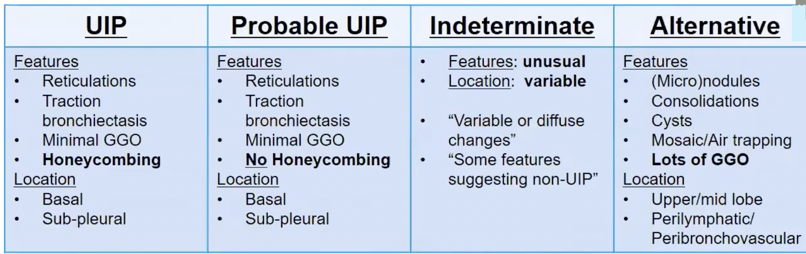

### Intro

Collection of themes, presentations, code and ideas. Many of which have been borrowed and modified

## GSlides Integration

[Medicine](https://docs.google.com/presentation/d/e/2PACX-1vSEOl799T-PCAQyMmYVAwB9_d0iDkslyIUFhLj3GfsY0jRrnWwOlu8O7MFDOJN1Y_zZUzJPINlByobB/pub?start=true&loop=true&delayms=60000)

## Index

| QI Methods                                                                                                                                        | Description                                                            |
|:-----------------------------------------------------------------------------------------------------------------------------------------------|:-----------------------------------------------------------------------|
| [SPC](https://c-baillie.github.io/rules/)| Statistical Process Control (SPC) Charts Rules                                                      |
|[DataGuide](https://c-baillie.github.io/DataGuide) | The Health Care Data Guide: Outline                                                        | 

| Rotations                                                                                                                                       | Description      |
|:-----------------------------------------------------------------------------------------------------------------------------------------------|:-----------------------------------------------------------------------|
| [Gen Med 1](https://c-baillie.github.io/med1) | Gen Med 1: Articles                                                                            |

| CT Chest                                                                                                                                     | Description      |
|:-----------------------------------------------------------------------------------------------------------------------------------------------|:-----------------------------------------------------------------------|
| [Typical UIP](https://www.pacsbin.com/c/b1Kd-L9R0G?ww=1400&wc=-500&i=301) | UIP                                                                        |
| [Probable UIP](https://www.pacsbin.com/c/-ylK6AuFPQz?ww=1400&wc=-500&i=86&s=1) | UIP                                                                        |
| [Ind UIP/IPF](https://www.pacsbin.com/c/bJDaIHF3IG?ww=1400&wc=-500&i=36) | UIP                                                                        |
| [Non-IPF](https://www.pacsbin.com/c/Zkv_UUtn8f?ww=1400&wc=-500&s=0&i=27) | Non-IPF                                                                       |

| Borrowed/Code                                                                                                                                      | Description                  |      
|:-----------------------------------------------------------------------------------------------------------------------------------------------|:-----------------------------------------------------------------------|
| [Functions and Themes for gt tables](https://themockup.blog/posts/2020-09-26-functions-and-themes-for-gt-tables)                               | Save time and effort in making beautiful tables                        |
| [10+ Guidelines for Better Tables in R](https://themockup.blog/posts/2020-09-04-10-table-rules-in-r)                                           | Make tables people ACTUALLY want to read.                              |
| [Heatmaps in ggplot2](https://themockup.blog/posts/2020-08-28-heatmaps-in-ggplot2)                                                             | It’s more than just a passing fad.                                     |

